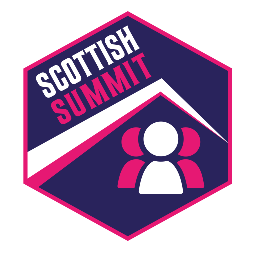

# 🔌 Build, Deploy, and Scale Power Apps with pipelines for Power Platform

> [!NOTE]
> This repository is for the "Build, Deploy, and Scale Power Apps with pipelines for Power Platform" workshop at the Scottish Summit on the 17th of October 2024 in Aberdeen, Scotland.

## 📝 Workshop description

Learn how to build and deploy Power Apps for enterprise scale across your organization. For more advanced makers and developers, you'll get hands-on experience with the full application lifecycle: from setting up your tenant with the right guardrails, development best practices to ensure your apps run performantly, deploying your work using the newest AI-powered pipelines ALM capabilities, and ensuring all this is easily governable.

## 🚀 Labs

The labs are as follows:

- [Lab 01: Setup and configure](./lab1/README.md)
- [Lab 02: Develop](./lab2/README.md)
- [Lab 03: Deploy](./lab3/README.md)
- [Lab 04: Enterprise Scale](./lab4/README.md)

## Contributing

This project welcomes contributions and suggestions.  Most contributions require you to agree to a
Contributor License Agreement (CLA) declaring that you have the right to, and actually do, grant us
the rights to use your contribution. For details, visit https://cla.opensource.microsoft.com.

When you submit a pull request, a CLA bot will automatically determine whether you need to provide
a CLA and decorate the PR appropriately (e.g., status check, comment). Simply follow the instructions
provided by the bot. You will only need to do this once across all repos using our CLA.

This project has adopted the [Microsoft Open Source Code of Conduct](https://opensource.microsoft.com/codeofconduct/).
For more information see the [Code of Conduct FAQ](https://opensource.microsoft.com/codeofconduct/faq/) or
contact [opencode@microsoft.com](mailto:opencode@microsoft.com) with any additional questions or comments.

## Trademarks

This project may contain trademarks or logos for projects, products, or services. Authorized use of Microsoft 
trademarks or logos is subject to and must follow 
[Microsoft's Trademark & Brand Guidelines](https://www.microsoft.com/en-us/legal/intellectualproperty/trademarks/usage/general).
Use of Microsoft trademarks or logos in modified versions of this project must not cause confusion or imply Microsoft sponsorship.
Any use of third-party trademarks or logos are subject to those third-party's policies.
