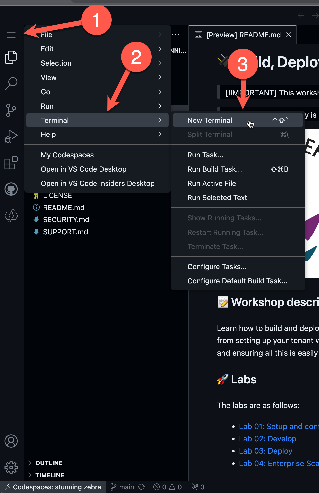
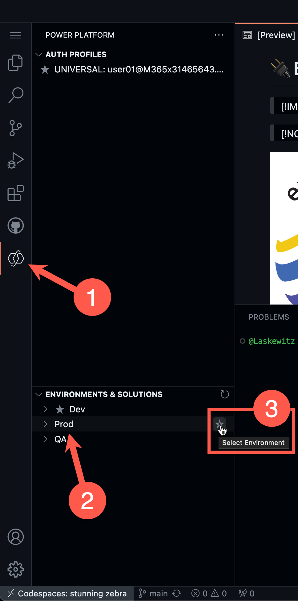
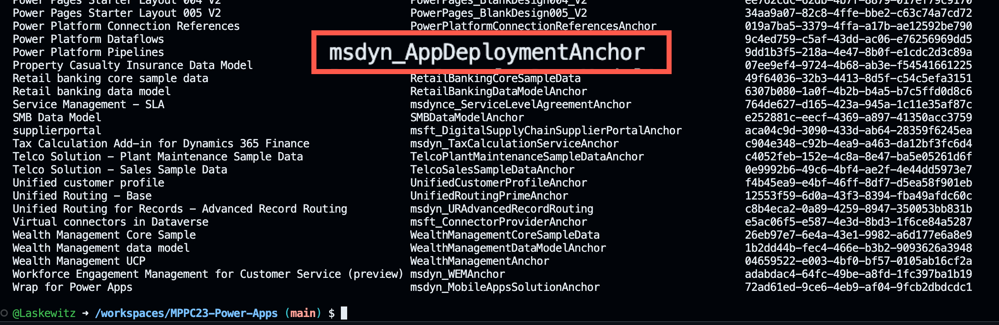
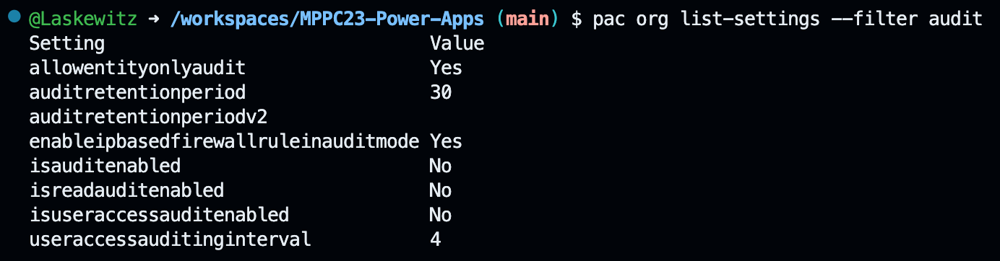
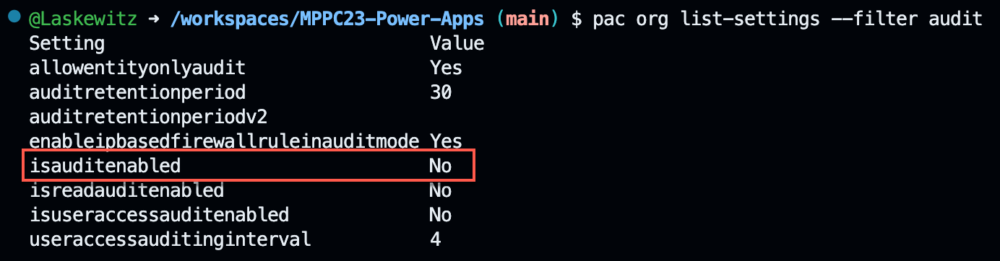
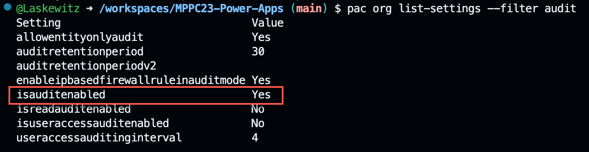

# 🚀 Lab 1: Setup and configure

Before we start with the lab, there are a couple of things we want you to be aware of:

1. Your credentials are provided to you by your trainers during the workshop at Scottish Summit 2024
1. Instead of a password, you will get asked for a temporary access pass (TAP), this will look a bit different than normally, but it will act the same as a password.

## Lab 1 - Tasks

In this lab, you will go though the following tasks:

- Log into make.powerapps.com with your account
- Enable Managed Environments on all environments
- Deploy the pipelines solution to your Prod environment

## Task 1: Log on to your account

With the credentials that were provided to you by the trainers, let's log into the account you are going to use during this workshop.

1. Go to [make.powerapps.com](https://make.powerapps.com)
1. On the sign-in screen, enter the email address that was provided to you and then click **Next**

    

1. Then enter the temporary access pass (TAP) and click **Sign in**
    

1. If you're prompted to stay signed in, click **Yes**

    You should now be logged in and on the Power Apps Home Page.

    

## Task 2: Deploy the pipelines solution to your Prod environment

In this task, you will learn how to install the pipelines for Power Platform solution in your `Prod` environment. This solution is needed to configure pipelines.

> **NOTE:**  
> Normally, it's a best practice to install the pipelines solution on a separate "Pipelines Host" environment. In this lab, you will install it in the `Prod` environment because a you can have three **free** developer environments, so you don't have space for another `Pipelines Host` environment next to `UserXX-Dev`, `UserXX-QA`, and `UserXX-Prod` environments.
>
> This is a best practice because you will avoid people accidentally using dependencies on the pipelines tables, or having issues with sharing pipelines and giving people the right security roles. Take a look at the [FAQ on Microsoft Learn](https://learn.microsoft.com/power-platform/alm/pipelines#frequently-asked-questions) to learn more best practices.

There are two ways to install the pipelines solution:

### Via Power Platform Admin Center

1. Go to the [Power Platform Admin Center](https://aka.ms/ppac)

    

1. Select the **Prod** environment you created before

1. In the command bar at the top (make sure you use the button at the top and don't use the left navigation - which also has a resources button), select **Resources** and **Dynamics 365 apps**

    

1. Here you can find the apps that are installed on your `Prod` environment by default. Select the **Install App** button in the command bar at the top

    

1. In the sidebar that opens, scroll all the way down select the **Power Platform Pipelines** app and select the **Next** button at the bottom of the sidebar

    

1. Next, make sure to agree to the terms and select the **Install** button at the bottom of the sidebar

    

This process will take a couple of minutes, you can refresh the page by selecting the **Refresh** button in the command bar at the top.

When finished, you can go to the [maker portal](https://make.powerapps.com) and select the right environment (`Prod`). If all went well, you should be able to see the `Deployment Pipeline Configuration` app in the Apps section in the maker portal.

### Via Power Platform CLI

1. Open up your Codespace.

1. Open a new terminal by selecting the **Hamburger Menu > Terminal > New Terminal**

    

1. Open the Power Platform Tools VS Code Extension by selecting the Power Platform DevTools icon on the left, make sure you see the `Prod` environment in the Environments & Solutions panel and select the empty star behind it to select the right environment.

    

1. Enter the following command:

    ```bash
    pac application list
    ```

    This command will return all the applications that you can install with the `pac application install` command.

    Zoomed in and highlighted is the unique name of the `Power Platform Pipelines` application: `msdyn_AppDeploymentAnchor`.

    

1. Now we can install the `Power Platform Pipelines` application by using the following command:

    ```bash
    pac application install --application-name msdyn_AppDeploymentAnchor
    ```

    This command will return all the applications that you can install with the `pac application install` command.

## Task 10: Enable Dataverse settings

A recent addition to the Power Platform CLI is the ability to list and update Dataverse settings. This means that you can change the settings that are normally only available through the UI. In this task, you will learn how to change the settings.

### List Dataverse settings

1. Make sure to run the `pac org who` command to make sure you are in the `Dev` environment
    If not, make sure to switch there, using the pac org select command like we did in task 7
1. Run the following command and then press **Enter**:

    ```bash
    pac org list-settings
    ```

    This command will return all the settings in the org we are connected to now (the `Dev` environment). As you can see, this is a very large list. You can filter them though.

1. Add the `--filter` parameter and filter for all settings that contain `audit` with the following command:

    ```bash
    pac org list-settings --filter audit
    ```

    This command will return all the settings that contain `audit` in the org we are connected to now (the `Dev` environment). As you can see, this is a way smaller list than what we saw before.

    

### Update Dataverse settings

Let's try out how updating a setting works. In the list of audit settings we just saw, there is a `isauditenabled` setting which is set to **No**.



1. Run the following command and then select **Enter**:

    ```bash
    pac org update-settings --name isauditenabled --value true
    ```

    This command will set the `isauditenabled` setting to true.

    > **Note:** 
    > Note that the list command showed `No` as the output, but for updating you need to use true or false.

1. Run the following command again to verify if the setting is applied and select **Enter**:

    ```bash
    pac org list-settings --filter audit
    ```

    This command will return all the settings that contain `audit` in the org we are connected to now (the `Dev` environment). As you can see, the `isauditenabled` setting is now set to `No`.

    

## Next lab

This is the end of lab 1. Select the second page below to move to the next lab.
