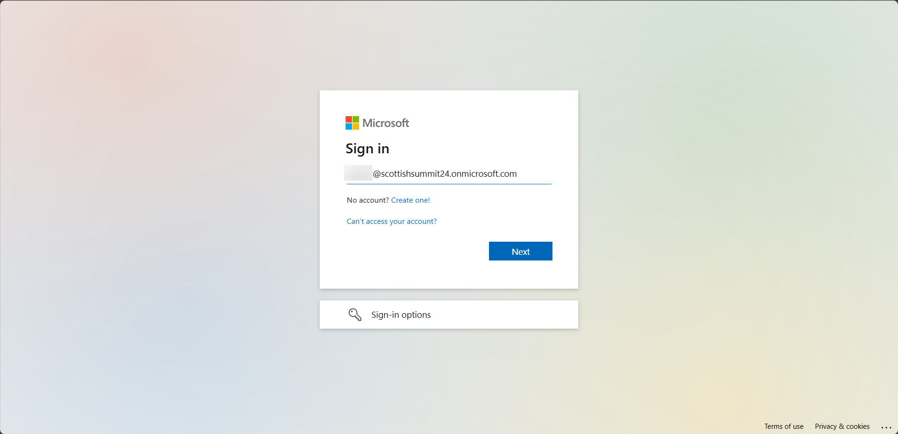
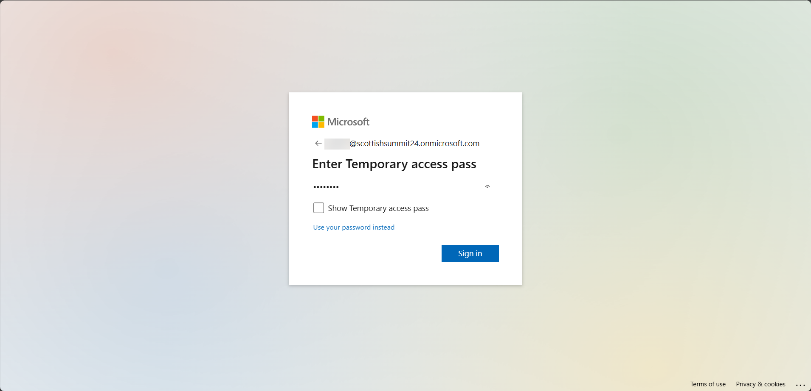
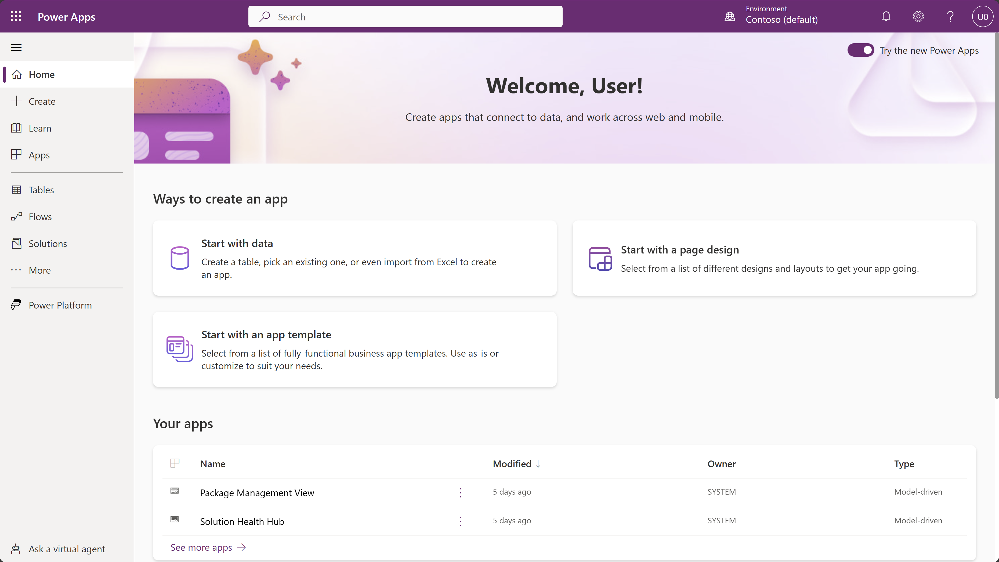
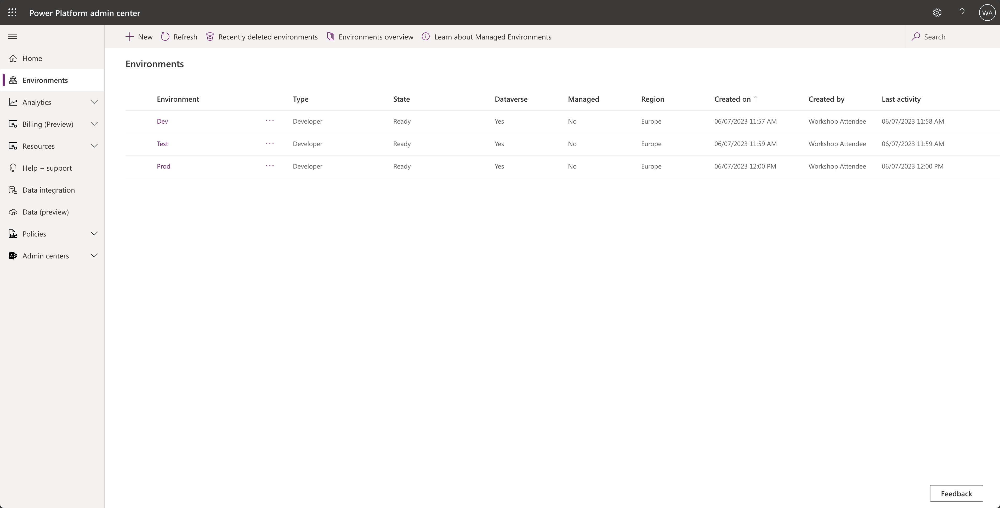
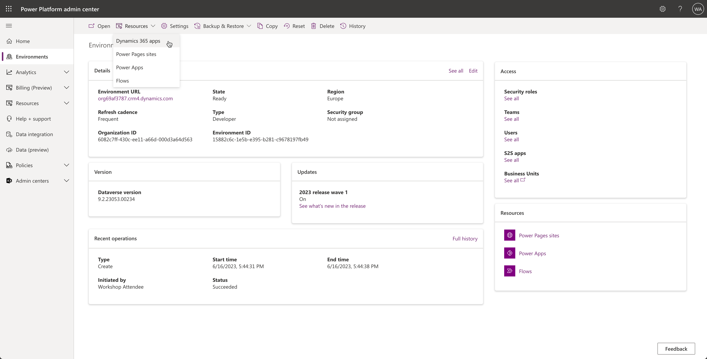
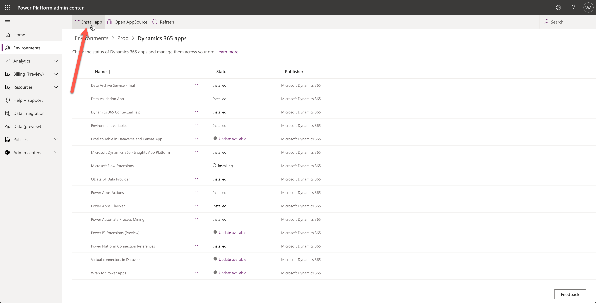
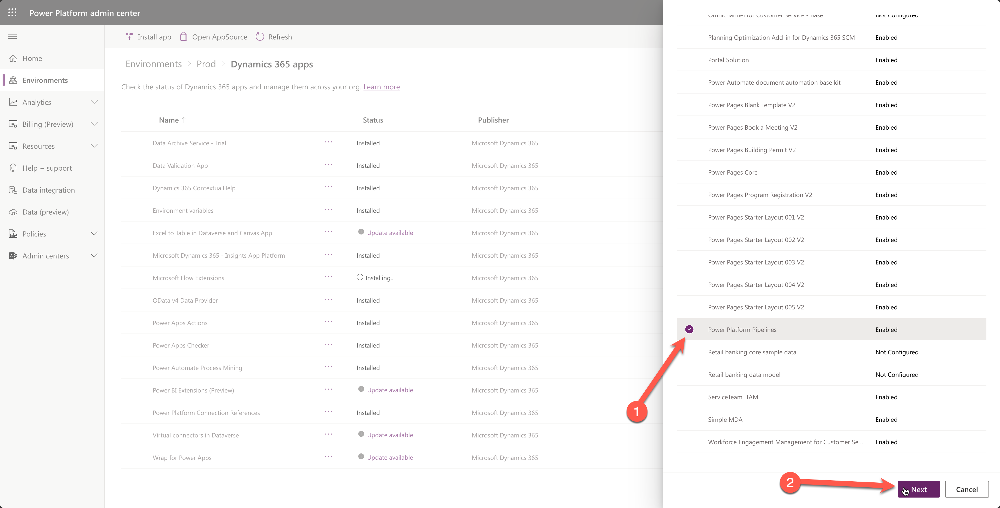
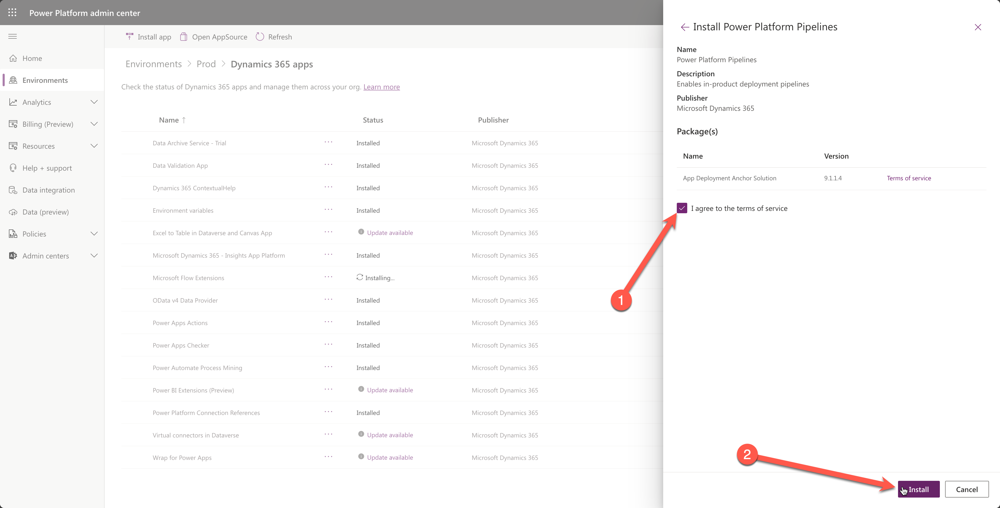

# 🚀 Lab 1: Setup and configure

Before we start with the lab, there are a couple of things we want you to be aware of:

1. Your credentials are provided to you by your trainers during the workshop at Scottish Summit 2024
1. Instead of a password, you will get asked for a temporary access pass (TAP), this will look a bit different than normally, but it will act the same as a password.

## Lab 1 - Tasks

In this lab, you will go though the following tasks:

- Log into make.powerapps.com with your account
- Deploy the pipelines solution to your Prod environment

## Task 1: Log on to your account

With the credentials that were provided to you by the trainers, let's log into the account you are going to use during this workshop.

1. Go to [make.powerapps.com](https://make.powerapps.com)
1. On the sign-in screen, enter the email address that was provided to you and then click **Next**

    

1. Then enter the temporary access pass (TAP) and click **Sign in**
    

1. If you're prompted to stay signed in, click **Yes**

    You should now be logged in and on the Power Apps Home Page.

    

## Task 2: Deploy the pipelines solution to your Prod environment

In this task, you will learn how to install the pipelines for Power Platform solution in your `Prod` environment. This solution is needed to configure pipelines.

> [!IMPORTANT]
>  
> Normally, it's a best practice to install the pipelines solution on a separate "Pipelines Host" environment. In this lab, you will install it in the `UserXX-Prod` environment because a you can have three **free** developer environments, so you don't have space for another `Pipelines Host` environment next to `UserXX-Dev`, `UserXX-QA`, and `UserXX-Prod` environments.
>
> This is a best practice because you will avoid people accidentally using dependencies on the pipelines tables, or having issues with sharing pipelines and giving people the right security roles. Take a look at the [FAQ on Microsoft Learn](https://learn.microsoft.com/power-platform/alm/pipelines#frequently-asked-questions) to learn more best practices.

There are two ways to install the pipelines solution:

### Via Power Platform Admin Center

1. Go to the [Power Platform Admin Center](https://aka.ms/ppac)

    

1. Select the **UserXX-Prod** environment (where XX is the number of your user)

1. In the command bar at the top (make sure you use the button at the top and don't use the left navigation - which also has a resources button), select **Resources** and **Dynamics 365 apps**

    

1. Here you can find the apps that are installed on your `UserXX-Prod` environment by default. Select the **Install App** button in the command bar at the top

    

1. In the sidebar that opens, scroll all the way down select the **Power Platform Pipelines** app and select the **Next** button at the bottom of the sidebar

    

1. Next, make sure to agree to the terms and select the **Install** button at the bottom of the sidebar

    

This process will take a couple of minutes, you can refresh the page by selecting the **Refresh** button in the command bar at the top.

When finished, you can go to the [maker portal](https://make.powerapps.com) and select the right environment (`UserXX-Prod` - replace `XX` by your user number). If all went well, you should be able to see the `Deployment Pipeline Configuration` app in the Apps section in the maker portal.

## Next lab

This is the end of lab 1. Select the second page below to move to the next lab.
