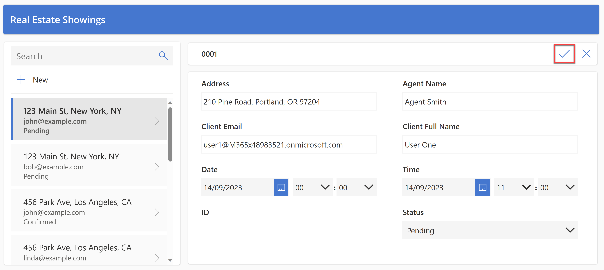

# 🚀 Lab 2: Develop

## 📝 Lab 2 - Tasks

In this lab, you will go though the following tasks:

✅ Creating A Canvas App With Power Apps Copilot
✅ Create A Solution
✅ Add Required Components To Solution

## ☑️ Task 1: Create a solution

In this task, you will create a solution for the components we just created via Copilot!

1. Go to [make.powerapps.com](https://make.powerapps.com/) and Sign In with your Power Apps credentials.

1. From the Power Apps home screen, select Solutions in the left navigation.

    

1. Select **+ New solution** at the top of the screen.

    

1. Add the solution display name `Scottish Summit 2024`, change the name to `SS2024` and select **+ New publisher**

    

1. Add the `Display name`, `Name` and `Prefix`. Select **Save** when you're done.

    

1. Select the newly created publisher from the `Publisher` dropdown.

    

1. Select the **Create** button at the bottom.

    

This concludes task 3, you have created the `Scottish Summit 2024` solution.


## ☑️ Task 2: Set your preferred solution

Now you have created your solution, it's time to set the solution as your preferred solution.

1. Select the **gear** icon in the top right corner
1. Select the text **Set preferred solution**

    

1. Select the **arrow** that points down to show all solutions and select **Scottish Summit 2024**.

    

1. Select the **apply** button to confirm your choice.

    

## ☑️ Task 3: Create a Canvas App with Power Apps Copilot

In this task, you’ll create an application leveraging Power Apps Copilot.  This app will be used by field agents to browse real estate inventory and manage appointments for showings and the data will be stored in Dataverse.

### Create a canvas app with natural language

1. Go to the Home page in Power Apps, by navigating to [make.powerapps.com](https://make.powerapps.com)
1. On the Home page in Power Apps, in the center text field, enter the following prompt to search for an AI-generated table:

   `build an app to manage real estate showings`

   Select the **Send** button.

    
   
1. After Copilot AI generates a table based on your prompt, look through the table to view the columns that are created for the start of your table.

   
   

   Your next steps are to modify and add to the already generated table.
1. In the text box, in the lower part of the **Copilot** pane to the right of the screen, enter the following text:

   `add a column to track client full name`

   Select the **Send** button.

   Copilot notifies you that the table is updated, and the new column should show as being added to the table.

   
   
1. Enter the following text into the chat:

   `add a column to track client email`

   Select the **Send** button.

   A new column is added to the table and displays the client’s email.

   
   

> [!NOTE]
>
> The data that's generated in your table might vary from the data that's shown in the table in the screenshots for this lab.

> [!NOTE]
>
> The **Suggestions** section in the lower-left corner of the screen provides you with different suggestions on how you can add to and modify your table.
   

   

   On the right of the screen, it appears as if you're having a conversation with a Copilot while adding to and modifying your table. This area is where you can scroll through and view the changes or additions that you've made to your table.

   
   
6. Edit the **Status** column within the table.

> [!NOTE]
>
> If you don't have a status column, you may need to add one via the Copilot chat first using statements such as:
> 
> * ```add a status column to track the status of the showing```
> * ```status should have options for Pending, Confirmed, and Cancelled```
> * ```set the default choice of Status to Pending```

In the text box within the **Copilot** pane, enter the following text and then send it:

   ```add an option for “Completed” to the Status column```

The system might take a minute to load. When it does, the **Status** column shows as updated and includes the option for **Completed**.

7. Select the **Status** column name dropdown menu and then select **View column** where you can view the columns’ properties and the current status details and data.

   
   

> [!NOTE]
>
> If your column choices aren't the same as the ones that are shown in the screenshot, enter the following command into the **Copilot** pane text box and then send it:
>
> `the status choices should be Pending, Confirmed, Cancelled, and Completed`
   
Select the **X** in the upper-right corner of the pane to close it.

Next, you'll add more data to your table and the existing columns.

8. In the **Copilot** pane text box, enter and send the following text:

   `add 5 more rows of data`

   Five more rows of data are added for each existing column in the table.

   
   

   Your table should have several columns. However, to continue following the labs in this workshop, try to remove some columns that you won't use.

   The list of columns that you need are:

   - ID
   - Address
   - Date
   - Time
   - Status
   - Agent Name
   - Client Full Name
   - Client Email

   Use what you've learned with the **Copilot Chat** window to adjust your table to match the preceding list. Make sure that you refer to the **Suggestions** section if you need to remove a column, change a column name, or add a column.

8. To create the app, select the **Create app** button in the lower-right corner of the screen.

   ]
   
9. When the app first loads, a dialog might appear stating **Welcome to Power Apps Studio**. If so, select the **Skip** button.

   The app that has been built for you should show in **Edit** mode.

   

### Modify the Real Estate Showings table
   
1. Select the **Data** icon from the left navigation bar. Copilot has created a **Dataverse** table that's now displaying in the **Environments** section.

    

> [!NOTE]
>
> Currently, Copilot is only supported for Dataverse. You can't use any other data access point at this time.


Next, you'll edit the table now that the app has been created.

2. Within the **Data** pane, hover your mouse cursor over the table. To the right of the table, select the ellipsis (**...**).

3. From the menu, select **Edit data**.

    
    
4. In the **Edit table** dialog, you can add your own columns to the table or modify existing columns.

    
    
5. Select the **ID** column header from the table.

6. From the dropdown menu, select the **Edit column** option.

    
    
7. In this example, you don't want the **Data type** to be a **Single line of text**. To change that value, go to the **Edit column** pane, and then from the **Data type** dropdown menu, select **# Autonumber**.

8. Select **Save**.

    
    
9. Select the **Close** button in the lower-right corner of the **Edit table** dialog.

    The table should now show as **Refreshed** in the **Data** pane.

    

### Modify the canvas app user interface
    
1. Modify the gallery in the application so that it displays the relevant data. Select the **Tree view** icon to return to the Tree view.

2. On the app's main screen, select **RecordsGallery1** to display **Real Estate Showings** and then select the edit button to put the gallery in edit mode.

3. Select the **Title** and then set the **Text** value to the following formula:

    ```ThisItem.Address```

4. Select the **Subtitle** and then set the **Text** value to the following formula:

    ```ThisItem.'Client Email'```

5. Select the **Body** and then set the **Text** value to the following formula:

    ```ThisItem.Status```

    A single record in the gallery should now resemble the following image.

    
    
6. On the app's main screen, select the **Form** control.

    
    
7. On the **Properties** pane on the right, under the **Fields** property, select **Edit fields**.

    
    
8. In the **Fields** pane, expand the **ID** field.

9. From the **Control type** dropdown menu, change the type to **View text**.

    

    Because you previously changed the **ID** field to **Autonumber**, you don’t want users entering their own number; Dataverse automatically enters the numbers for you.

10. In the **Fields** pane, select the **X** in the upper-right corner to close the pane.

11. Make a new request for a property that shows in the app by selecting the **Play** button from the upper part of the screen.

    
    
12. In the left pane, select the **+New** button.

    
    
13. Though you could modify the form to automatically fill in the fields for you, for this lab, you'll complete this step manually to observe how the app works.

    Fill in the fields with the following information:

    - Agent Name - < Your name >
    - Client Full Name - < Your name >
    - Client Email - < Your email >
    - Date - < Any future date >
    - Time - < Any future time >
    - Status - `Pending`
    - Address - `210 Pine Road, Portland, OR 97204`

> [!NOTE]
>
> Usually, you would have a lookup field to the **Real Estate Properties** table, this lab doesn't provide one to keep it simple.
    
14. Select the check mark in the upper-right corner of the screen.

    
    
15. Select the **X** in the upper-right corner to close out of the app.

    If a dialog appears saying **Did you know?**, select **OK**.

    The new request is added to the left of the list of requests.

16. From the upper part of your screen, select the **Save** button to save the new app that you created.

    
    
    If the system prompts you, save the app name as **Real Estate Showings**.

17. Exit the app to return to the Power Apps home page.

Congratulations! You have now created a Power Apps Canvas App with Copilot!


## Next lab

This is the end of lab 2. [Go to lab 3](../lab3/README.md) to continue.
