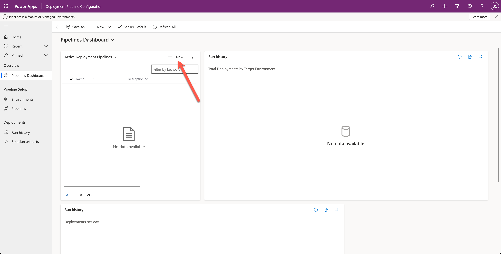
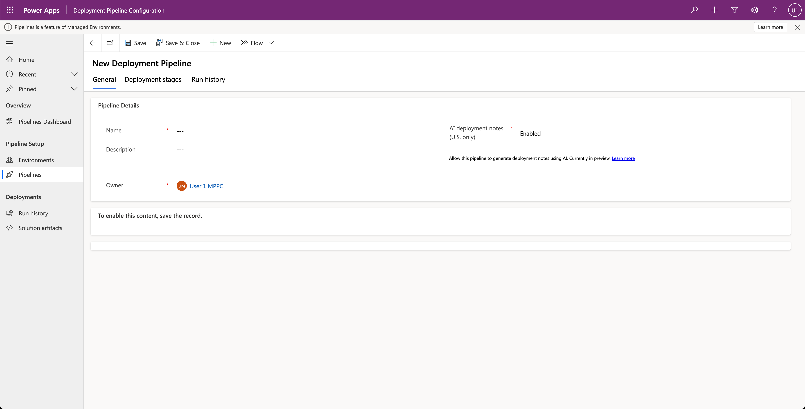
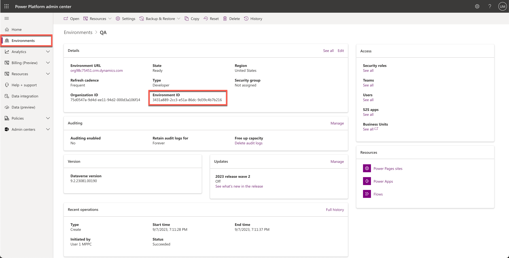
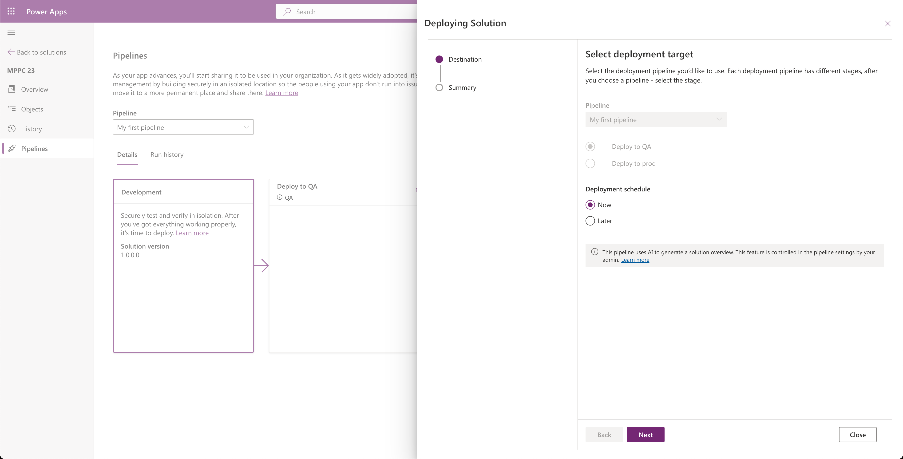
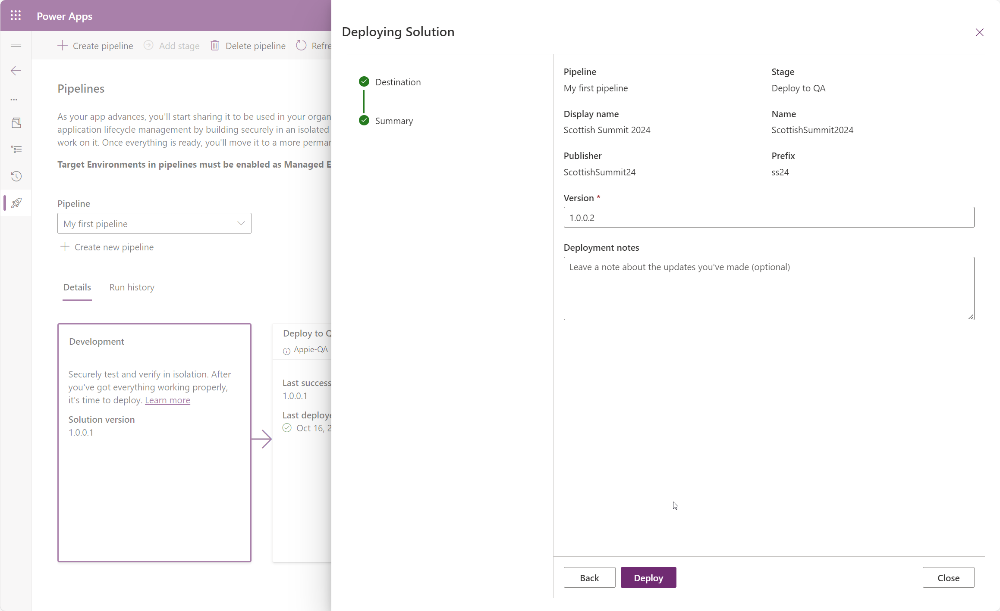
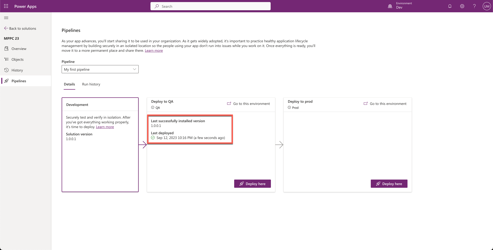
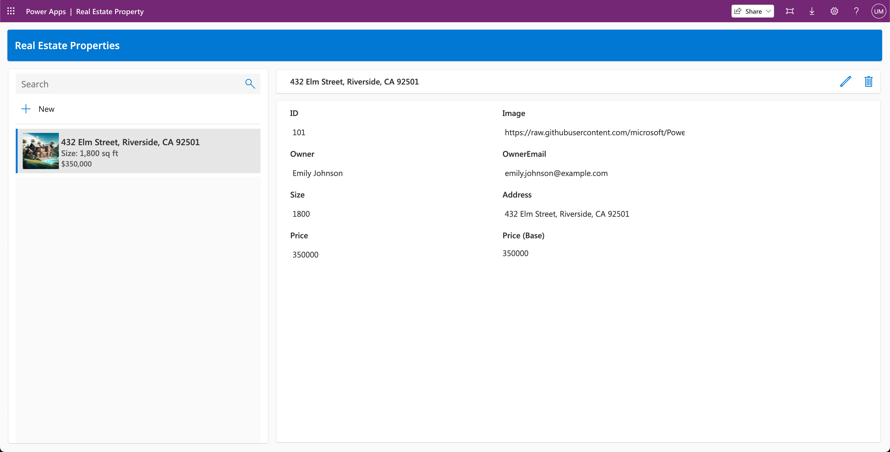
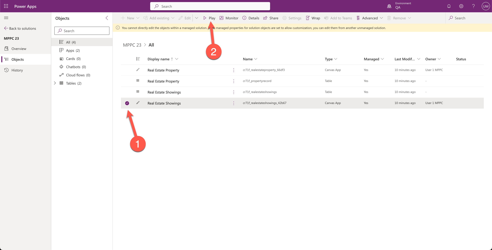
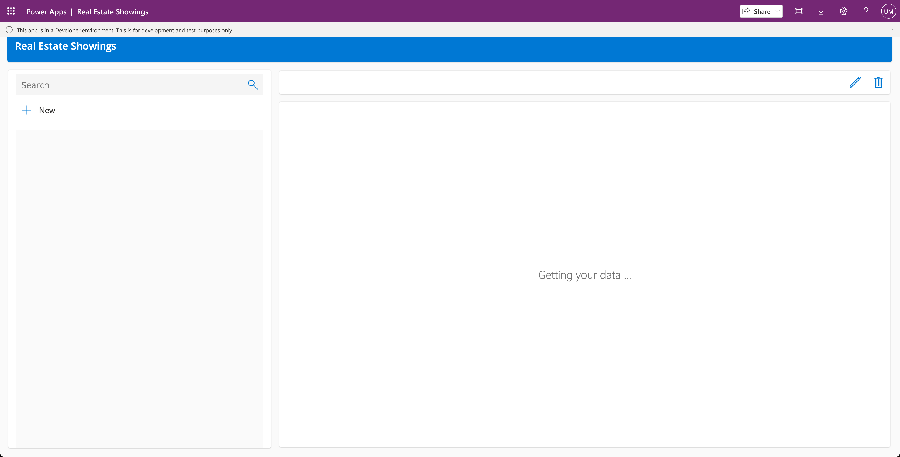
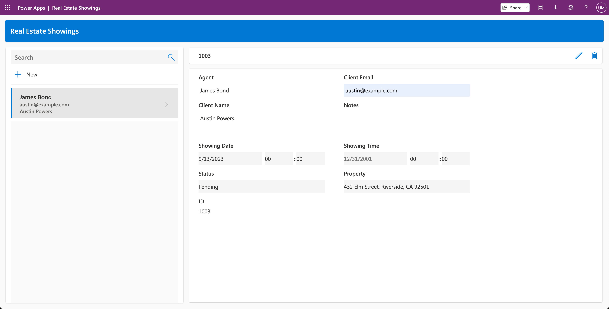

# 🚀 Lab 3: Deploy

## Lab 3 - Tasks

In this lab, you will go though the following tasks:

✅ Create your first pipeline  
✅ Run the deployment to the QA environment  

## Task 1: Create your first pipeline

In this task, you will create your first pipeline. The `Deployment Pipeline Configuration` app that you installed in lab 1 will be used for that.

Go to the [maker portal](https://make.preview.powerapps.com), and make sure you are in the `UserXX-Prod` environment.

Select the **Deployment Pipeline Configuration** app and make sure to **play** it.

This will open the app in a new tab:

Make yourself familiar with the app, by looking around which menu items there are:

First, there is an `Overview` section, where you land when you open the app. This is the `Pipelines Dashboard`, which will show you the latest info about runs and pipelines that are active. When you open this for the first time, it's supposed to be empty, so don't worry!

There is also a `Pipeline Setup` section where you can view your environments and pipelines.

Last but not least, there is a `Deployments` section which enables you to view the run history and find solution artifacts.

### Create a new pipeline

Let's create a new pipeline, by selecting the **+ new button** on the `Pipelines Dashboard`.

This will open a quick create form at the side.

1. Use `My first pipeline` as the name

1. Leave the rest as default and save the pipeline by selecting the **Save and Close** button

You will end up on the `Pipelines Dashboard` again, but now `My first pipeline` will be visible.

1. Click on the name `My first pipeline`

This will lead you to a form where you can enter details about your pipeline:

Scroll down and you will see the following content below the owner field:

As you can see there are two sections: **Linked Development Environments** & **Deployment Stages**.

**Linked Development Environments**

A pipeline can be available for multiple development environments. This is very convenient when you want to use multiple development environments and use shared test and shared production environments.

In this lab, we will only add one development environment to the Linked Development Environments, but when you use this at your company later on, remember that it can be more than one environment here.

**Deployment Stages**

The Deployment Stages section will give you the option to add stages after your development environment. So for instance, in our lab today, we are going to add a stage called `Deploy to QA` and another stage called `Deploy to Prod`. The cool thing is that we can set previous stages for these stages. This gives us the ability to make sure `Deploy to QA` goes first, and `Deploy to Prod` comes second.

### Create a development environment

Let's continue our lab and start by adding a new development environment by selecting the New Development Environment button in the Linked Development Environments section.

A sidebar will be opened, where you can enter the details of the `UserXX-Dev` environment you created in lab 01.

1. Add `UserXX-Dev` as the Name

1. Set the Environment Type to `Development Environment`

1. For the next step, make sure to grab the `Environment Id` from the Power Platform Admin Center

    - Open a new tab and go to the [Power Platform Admin Center](https://aka.ms/ppac)
    - Select **Environments** in the menu on the left
    - Select the environment named **Dev**

      

    - Copy the environment ID from there and paste it in the `Deployment Pipeline Configuration` app.

1. Select the **Save and Close** button on the bottom of your sidebar

If all went well, you'll see the following screen (*Refresh* the page if you don't see it):

Make sure to select the **+ New Deployment Stage** button now to add the first deployment stage.

### Add the first deployment stage

This will open a new form, where you can enter details about your first deployment stage.

1. Add `Deploy to QA` as the Name

1. We're leaving the Description and Previous Deployment stage empty, because we don't have a previous deployment stage, since this is our first stage

1. Set focus to the input box next to target deployment environment. This will open up a small popup which enables you to add a new deployment environment

1. Select **+ New Deployment Environment**

This will open another sidebar where you can add details about your QA environment.

#### Add the QA environment

In the sidebar, make sure to add the following details:

1. Add `UserXX-QA` as the `Name`

1. Add `Target Environment` as the `Environment Type`

1. Add the environment ID of the test environment

    - Open a new tab and go to the [Power Platform Admin Center](https://aka.ms/ppac)
    - Select **Environments** in the menu on the left
    - Select the environment named **QA**

      

    - Copy the environment ID from there and paste it in the `Deployment Pipeline Configuration` app.

1. Select the **Save and Close** button on the bottom of your sidebar

1. Select **Save and Close** to save at the top of your deployment stage form as well

Make sure to select the **+ New Deployment Stage** button again to add a second deployment stage: `Deploy to prod`.

### Add the `Deploy to prod` deployment stage

1. Add `Deploy to prod` as the `Name`

1. Leave the `Description` empty

1. Focus on the `Previous Deployment Stage` and search for the `Deploy to QA` stage. After you have found that stage, select it

1. Set focus to the input box next to target deployment environment. This will open up a small popup which enables you to add a new deployment environment

1. Select **+ New deployment Environment**

> **Note:**  
> There is a setting field called `Pre Deployment Step Required`. We're not using that in this case, but think about what could that be used for. During the workshop, the trainers will show an example of it.

#### Add the Prod environment

1. Add `UserXX-Prod` as the Name

1. Set the Environment Type to `Target Environment`

1. For the next step, make sure to grab the `Environment Id` from the Power Platform Admin Center

    - Open a new tab and go to the [Power Platform Admin Center](https://aka.ms/ppac)
    - Select **Environments** in the menu on the left
    - Select the environment named **Prod**

      

    - Copy the environment ID from there and paste it in the `Deployment Pipeline Configuration` app.

1. Select the **Save and Close** button on the bottom of your sidebar

    

1. Select **Save and Close** to save at the top of your deployment stage form as well

## Task 2: Run the deployment to the QA environment

In this task, you will deploy the solution we created in lab 2 to the QA and Prod environments. Let's start by deploying to QA. In this lab, you have configured a pipeline and the stages that belong to it. But how does a maker deploy a solution from the `UserXX-Dev` environment to the `UserXX-QA` and `UserXX-Prod` environments?

1. Go to the [maker portal](https://make.preview.powerapps.com)

1. Make sure to select the **Dev** environment

1. Go to **Solutions** via the left menu

1. Select the **Scottish Summit 2024** solution by selecting the display name

    

1. Select the **rocket icon** on the left

    

    This will show you a new screen where you can see an overview of all stages you just configured in the last task

    

1. Select the purple **Deploy here** button. This will open a new sidebar which will give you the option to start your deployment now or plan your deployment for later

    

1. Notice the message at below the deployment schedule. This indicates that this pipeline uses AI to generate a solution overview

    

1. Leave everything on default and select the purple **Next** button on the bottom of the sidebar

    This will lead you to the next section called `Summary`. Here you can find a bunch of info about the solution you are about to deploy to the QA environment. It also shows an AI suggested solution overview

    

    When you're happy with that AI generated solution overview, select the **Apply** button below the AI suggested solution overview

    Now the AI suggested solution overview is added in the `Deployment notes` box

    

1. Check the AI suggested solution overview to make sure it doesn't include any errors and correct where needed

1. Select the purple **Deploy** button

    

It will take a couple of minutes to deploy the solution to the QA environment. After it's done, the overview page for the pipelines should look like this:

As you can see, the last deployed solution version and last deployed date time are visible here.

### Test if the solution was correctly deployed to QA

1. Of course, you want to see for yourself if the deployment was successful, so select the **Go to this environment** button in the `Deploy to QA` stage

    

1. Select **Solutions** in the left navigation

1. Check if the `Scottish Summit 2024` solution with version 1.0.0.1 is installed in the `UserXX-QA` environment

    

1. Open the `Scottish Summit 2024`solution by selecting the **display name**

    

1. Select the **Real Estate Property** canvas app and select the **Play** button in the command bar at the top

    

1. This will open the app in a new tab

    

    It will look like your app is broken, since it will have the message `Getting your data`, but it's working fine! The problem is that there is no data in this environment, because we just deployed the solution here. Let's fix that!

1. Select the **+ New** button on the left side of the screen

1. Fill in the following fields with the information below:

    - ID: `101`

    - Image: `https://raw.githubusercontent.com/microsoft/PowerPlatformAdvocates/main/MSLearn/AIModule/Images/property1.jpg`

    - Owner: `Emily Johnson`

    - OwnerEmail: `emily.johnson@example.com`

    - Size: `1800`

    - Address: `432 Elm Street, Riverside, CA 92501`

    - Price: `350000`

1. Select the **check** to save the new row

    

1. Now you will see at least one row in the app and the app should look more familiar with the photo and the Power Apps Ideas formatting we did in lab 2

    

1. Select the **Real Estate Showings** canvas app and select the **Play** button in the command bar at the top

    

1. This will open the app in a new tab

    

    Again, it will look like your app is broken, since it will have the message `Getting your data`, but it's working fine!

1. Select the **+ New** button on the left side of the screen

1. Fill in the following fields with the information below:

    - Agent: `James Bond`

    - Client Email: `austin@example.com`

    - Client Name: `Austin Powers`

    - Showing Date: `<Pick the date of today - don't change the time>`

    - Showing Time: `<Pick the date of today - change the time to 10:00>`

    - Status: `Pending`

    - Property: `432 Elm Street, Riverside, CA 92501`

1. Select the **check** to save the new row

    

1. Now you will see at least one row in the app and the app should look more familiar like the `Real Estate Showings` app we created in lab 2

    

Now you know the app works in QA, let's deploy it to production.

## Next lab

This is the end of lab 3. [Go to lab 4](../lab4/README.md) to continue.
