# 🚀 Lab 4: Enterprise Scale

## Lab 4 - Tasks

In this lab, you will go through only one task:

- Extend the previous pipeline with Approvals

## ☑️ Task: Extend the previous pipeline with Approvals

### Extending the pipeline in the Deployment Pipeline Configuration App

In this task, you will learn how to extend the pipeline and add an approval before deploying to production.

1. Go to the [maker portal](https://make.powerapps.com)

2. Check if you are in the `UserXX-Prod` environment and if not, switch to that environment


3. Look for the `Deployment Pipeline Configuration` app, hover on it and select the play button

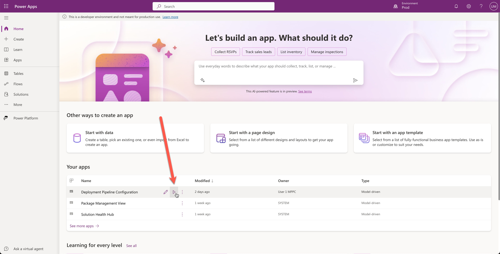

4. This will open the `Deployment Pipeline Configuration` app and will enable you to modify your pipeline. Select the `My first pipeline` pipeline


5. On the next screen, scroll down to the deployment stages and select the `Deploy to prod` deployment stage by selecting the name

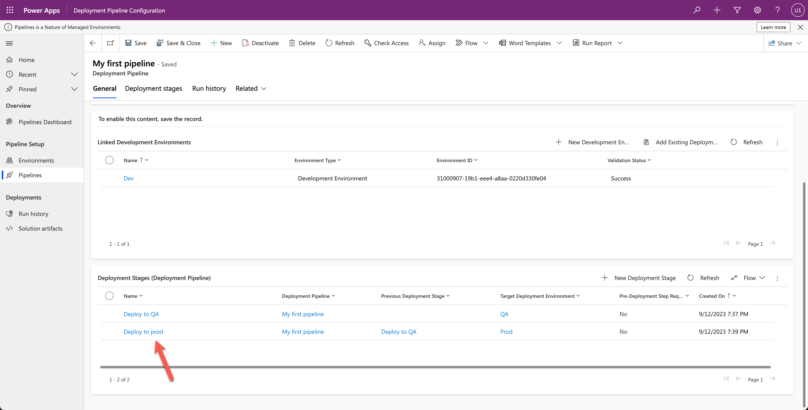

6. Enable the check box in the `Pre-Deployment Step Required` field and select the `Save & Close` button in the command bar at the top

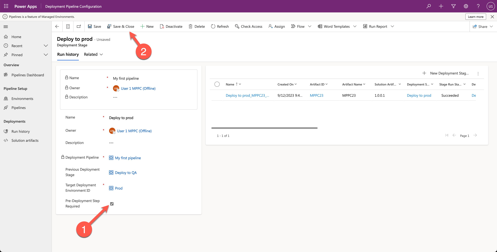

7. Check in the Deployment Stages subgrid if the `Pre-Deployment Step Required` field is changed to yes. If that's correct, you are done with this task, if not, go back to step 5 and try again


### Create a cloud flow that handles the approval

In this task, you will learn how to create an approval flow that will handle the approval before deploying to production.

1. Go to the [maker portal](https://make.powerapps.com)

2. Check if you are in the `UserXX-Prod` environment and if not, switch to that environment


3. Select **Flows** in the left navigation pane

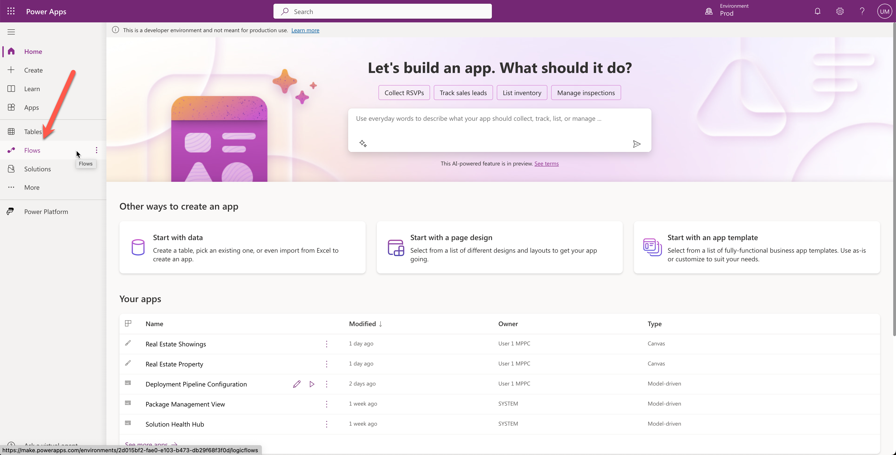

4. Select **Get started** in the welcome pop-up

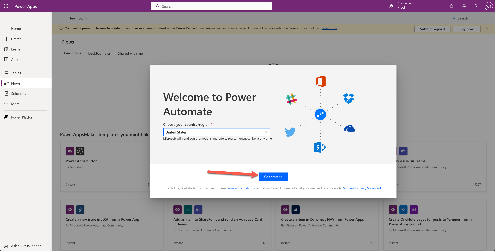

5. Select **Flows** in the left navigation, select **New flow** in the command bar at the top and select **Automated cloud flow**


6. This will open a pop up where you can name your flow and configure a trigger. Name your flow `My first pipeline production approval`, search for `action`, select the Microsoft Dataverse trigger called `When an action is performed` and select the blue **Create** button.  

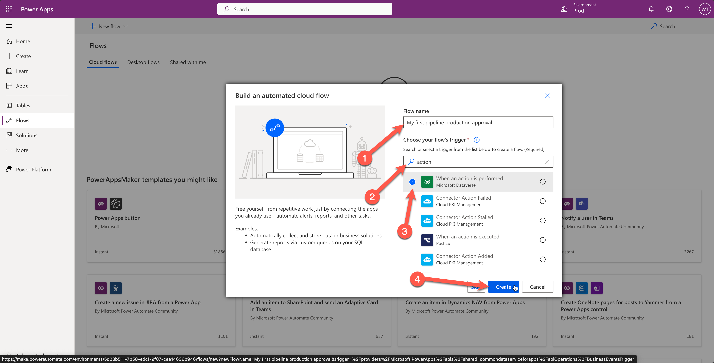

7. Configure the trigger inputs by making it look like the screenshot below

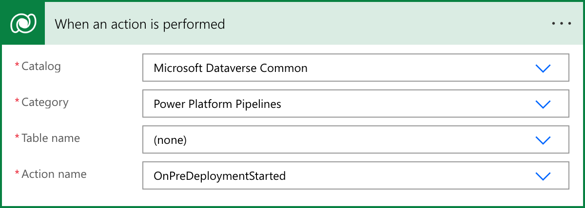
8. Select the **ellipsis** at the top-right corner of the trigger and select **settings** to open up the trigger settings


9. Select the **Add** button below trigger conditions to add a trigger condition in the trigger settings

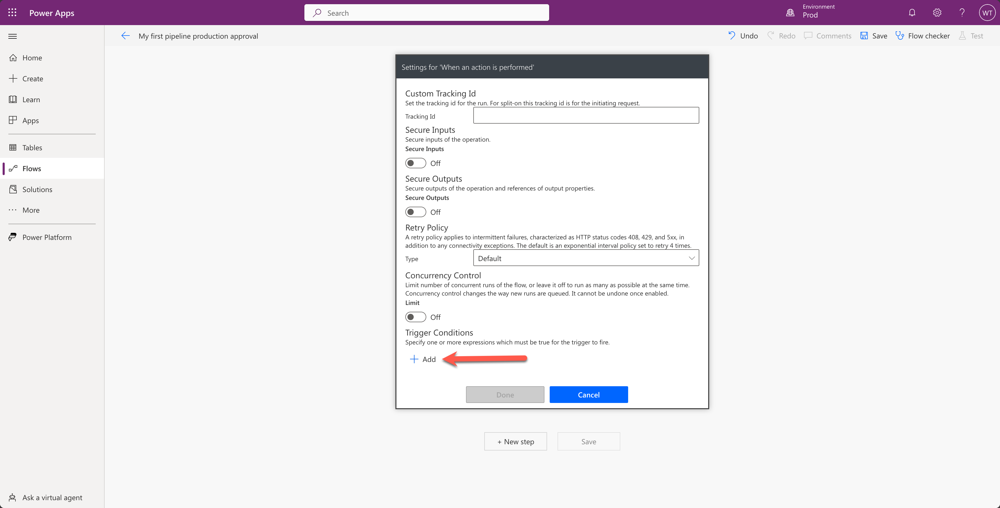
10. Add the following trigger condition to make sure the cloud flow only triggers when the pipeline name is equal to `My first pipeline`:

```
@equals(triggerOutputs()?['body/OutputParameters/DeploymentPipelineName'], 'My first pipeline')
```

11. Select the **Add** button below the trigger condition above to add another trigger condition

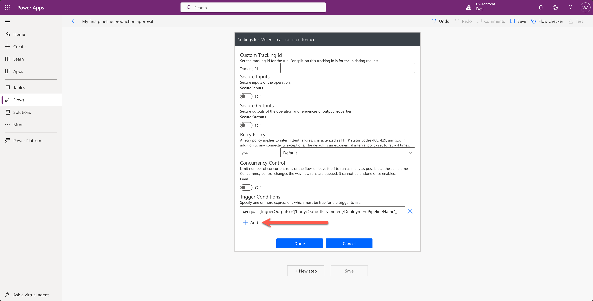

12. Add the following trigger condition to make sure the cloud flow only triggers when the pipeline name is equal to `Deploy to prod`:

```
@equals(triggerOutputs()?['body/OutputParameters/DeploymentStageName'], 'Deploy to prod')
```

13. Select the **Done** button at the bottom of the trigger card to save the trigger conditions

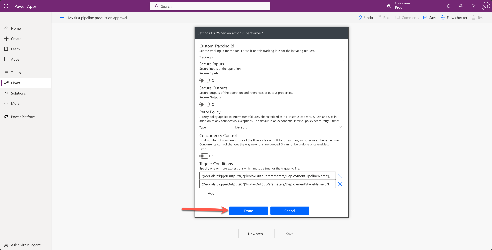

14. Select the **New step** button to add an action to start and wait for an approval

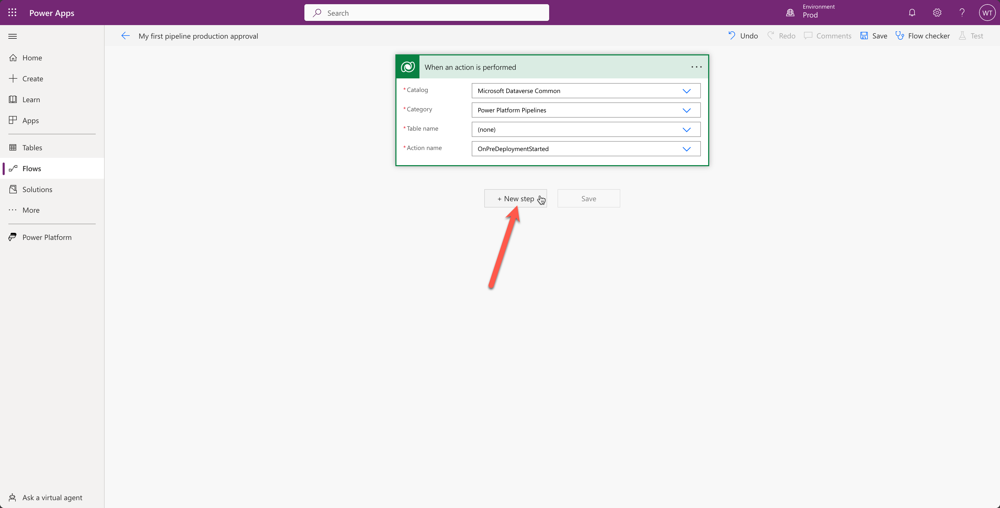

15. Search for `approval` and select the **Start and wait for an approval** action

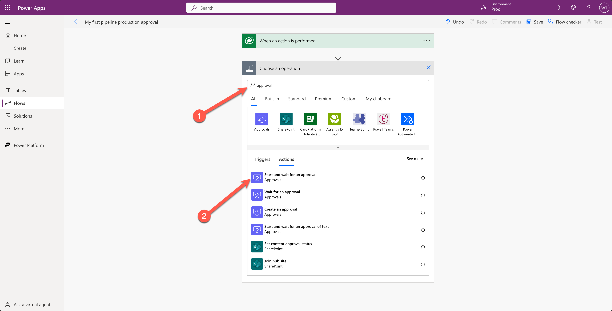

16. Configure the approval action like the screenshot below:  

For approval type, select **Approve/Reject - First to respond**  

For title, add `Approval requested for`, select **ActionOutputs DeploymentPipelineName** from the dynamic content fields on the right, add ` - `, and select another dynamic content field from the right called **ActionOutputs DeploymentStageName**.  

For assigned to, add the **email address of your user**.

In production scenarios, this would be an admin that would approve deployments.  

For details, add `# Deployment notes`, add a hard return, and select the **ActionOutputs DeploymentNotes** field from the dynamic content fields on the right.  

For item link, select the **ActionOutputs StageRunDetailsLink** field from the dynamic content fields on the right.  

For item link description, add `Stage Run Details`.  

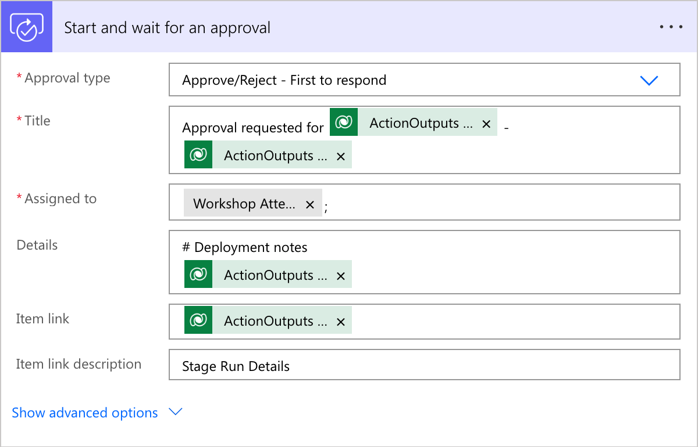

17. Select the **New step** button to add a condition below the `Start and wait for an approval` action

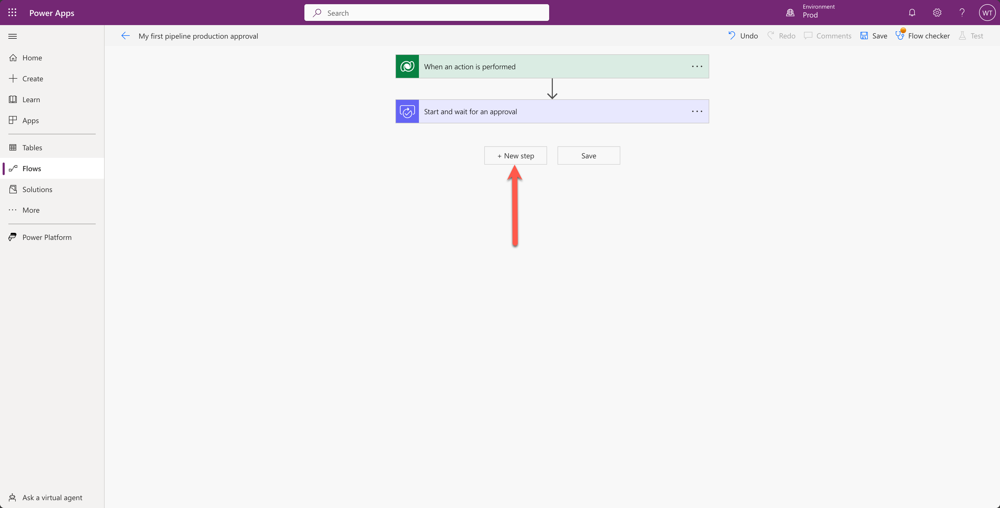

18. Add the **Condition** action

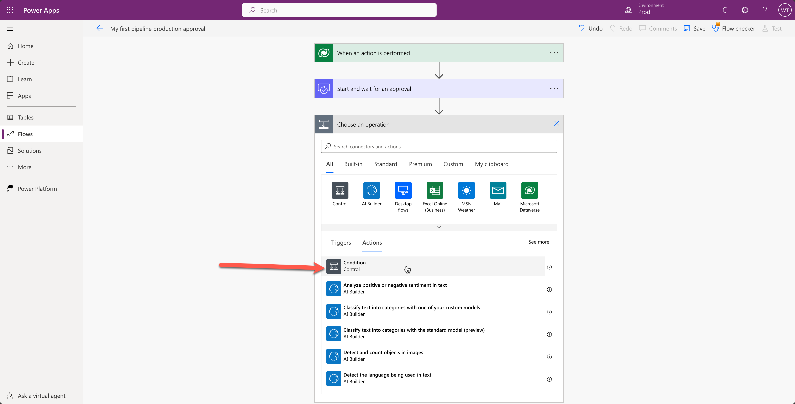

19. Add the **Outcome** dynamic content field from the **Start and wait for an approval** action in the first input field of the condition

20. Add the text `Approve` to the other input field of the condition

21. Select the **Add an action** button in the **If yes** part of the condition and add the **Perform an unbound action** action from the Microsoft Dataverse connector

Select **UpdatePreDeploymentStepStatus** as Action Name.  

Add `20` as the PreDeploymentStepStatus (20 is the status ID for approved).  

Add the **Response summary** dynamic content field from the **Start and wait for an approval** action as Comments.  

Add the following expression via the expression panel to the **Comments** field and select the blue **OK** button:

```
first(outputs('Start_and_wait_for_an_approval')?['body/responses'])?['comments']
```  

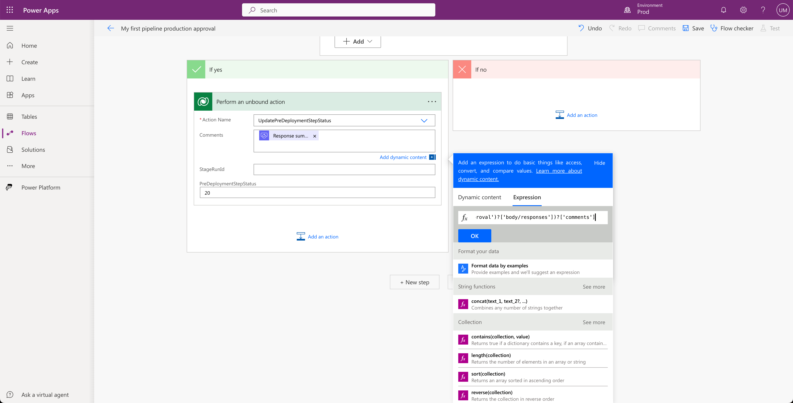

Add the **ActionInputs StageRunId** dynamic content field from the **When an action is performed** trigger as StageRunId.  

22. Select the **Add an action** button in the **If no** part of the condition and add the **Perform an unbound action** action from the Microsoft Dataverse connector

Select **UpdatePreDeploymentStepStatus** as Action Name.

Add `30` as the PreDeploymentStepStatus (30 is the status ID for rejected).  

Add the **Response summary** dynamic content field from the **Start and wait for an approval** action as Comments.  

Add the following expression via the expression panel to the **Comments** field and select the blue **OK** button:

```
first(outputs('Start_and_wait_for_an_approval')?['body/responses'])?['comments']
```

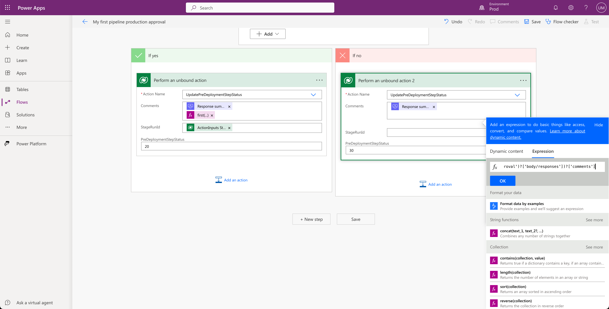  

Add the **ActionInputs StageRunId** dynamic content field from the **When an action is performed** trigger as StageRunId.  


23. Save the flow

### Test out the approval

In this task, you are going to find out if the approval you configured in the last task actually works!

#### Deploy to prod (with approval)

1. Go to the [maker portal](https://make.powerapps.com)

1. Check if you are in the **Dev** environment and if not, switch to that environment

    

1. Go to **Solutions** via the left menu

1. Select the **Scottish Summit 2024** solution by selecting the display name

    

1. Select the **rocket icon** on the left

    

1. Earlier in this lab, you have made a Pre-Deployment Step required. That means that now, there is an info box on the deploy to prod stage

    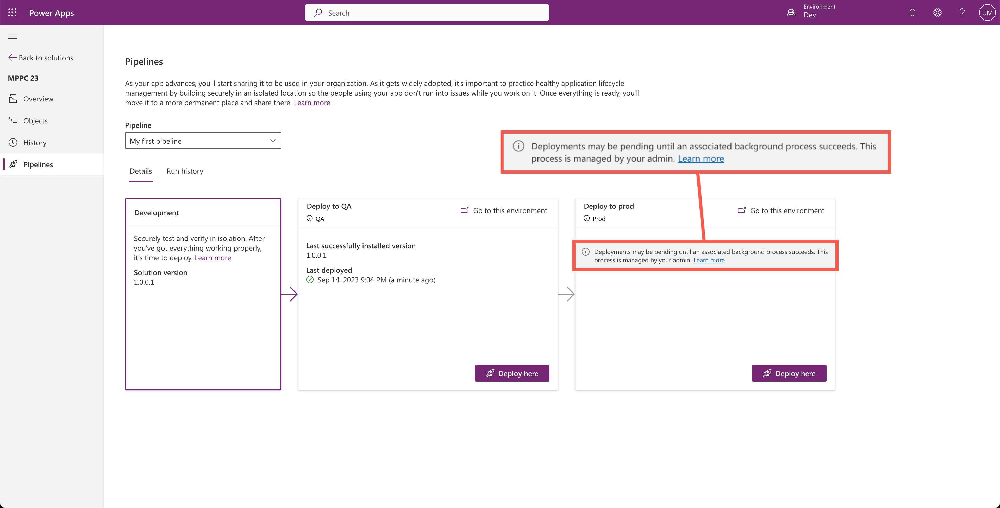

1. Select the purple **Deploy here** button.

    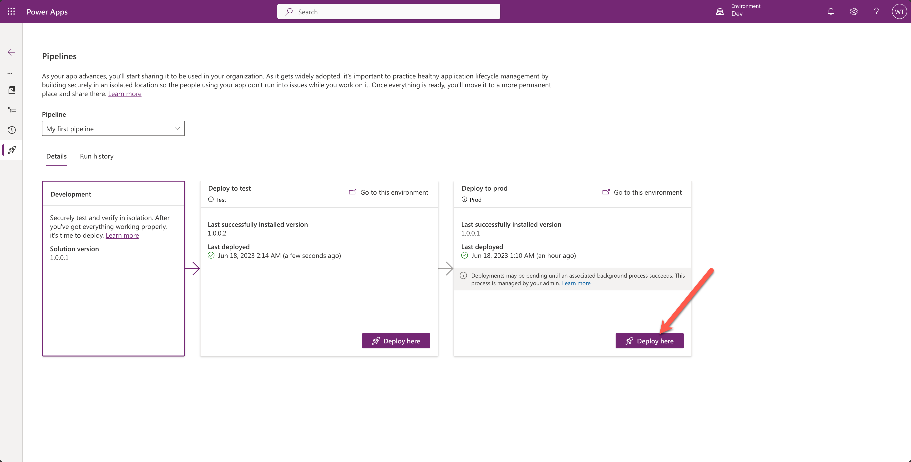  

1. This will open a new sidebar which will give you the option to start your deployment now or plan your deployment for later. Select the purple **Next** button to go to the next screen

    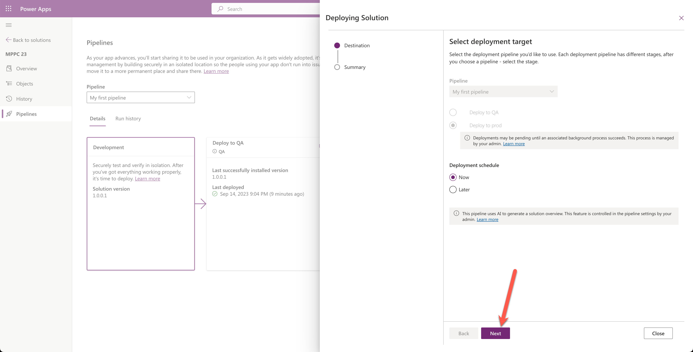  

1. Leave everything on default and select the purple Next button on the bottom of the sidebar

    This will lead you to the next section called `Summary`. Here you can find a bunch of info about the solution you are about to deploy to the QA environment. It also shows an AI suggested solution overview

    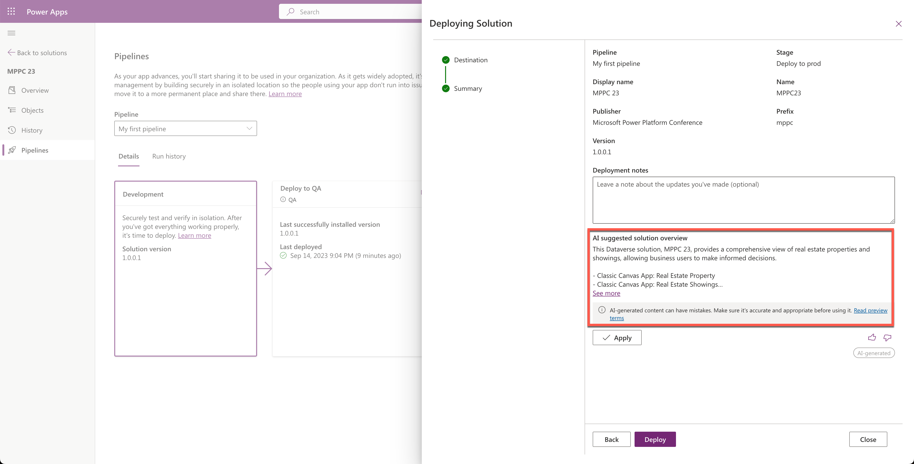

    When you're happy with that AI generated solution overview, select the **Apply** button below the AI suggested solution overview

    Now the AI suggested solution overview is added in the `Deployment notes` box

    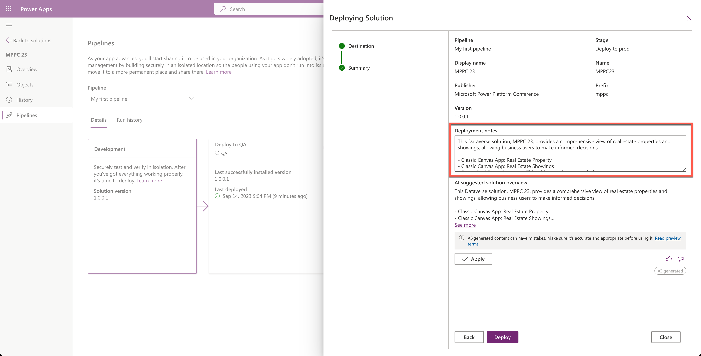

1. Check the AI suggested solution overview to make sure it doesn't include any errors and correct where needed

1. Select the purple **Deploy** button

1. Next, you will see the following screen, that shows a yellow box which states that `Your request to deploy here is pending.`

    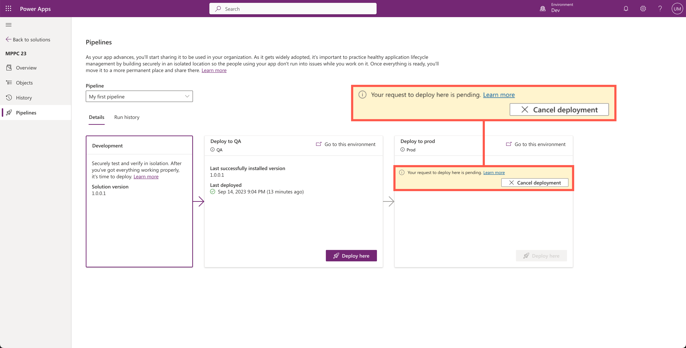

1. This message is showing because our changes in the beginning of the lab made sure that the Power Automate cloud flow is now triggered. We are working on a fresh environment, so it can take a while before the approval solution is deployed. Best is to take a break now, since it can take 5-10 minutes before your next step

1. Open a new browser tab and go to [Outlook web](https://outlook.office.com) and wait for the approval email. After 5-10 minutes (only the first time!) it should arrive

1. In the approval mail you will see a couple of familiar parts:  

    You will see the title of the approval (1)  

    You will see the deployment notes (2)  

    You will see approve / reject buttons (3)  

    You will be able to add comments (4)  

    You will be able to submit the approval / rejection (5)  

1. Make sure to select **Approve** in the approval email, add `Approved!` as comments and select the **Submit** button

    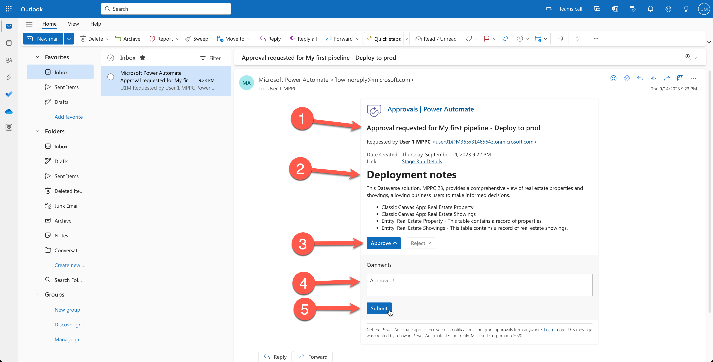  

1. Close the Outlook browser tab, and you will see (sometimes you have to refresh) that the deployment to production is in progress

    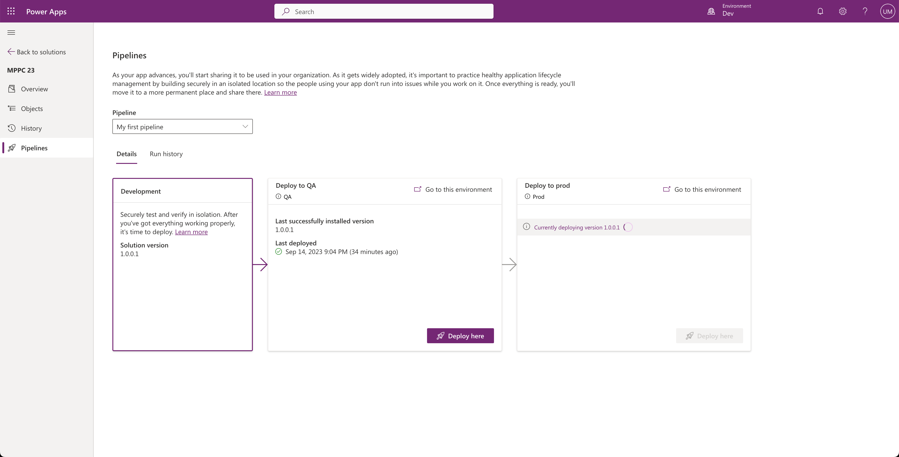

1. After the deployment is finished, you will see that the deployment is finished

    

And that's how the deployment with approvals works!

### Solution Checker Warning

In the meantime, you should've gotten another email.

1. Go to [Outlook web](https://outlook.office.com)

1. Look for an email with the subject `Solution checked for issues during import`

    It should look something like this:

    

    This email shows there are no solution checker issues found in our solution we just deployed to production: well done!

## End of labs

This is the end of lab 4. Select page 5 below to move to the next lab.
